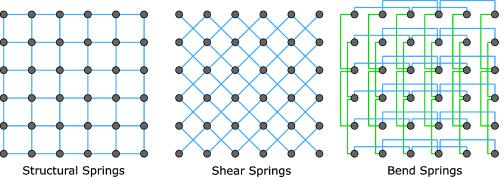
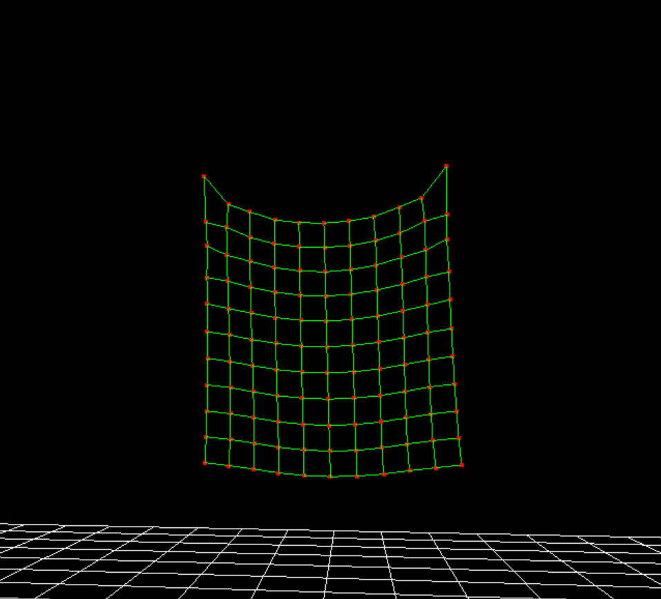
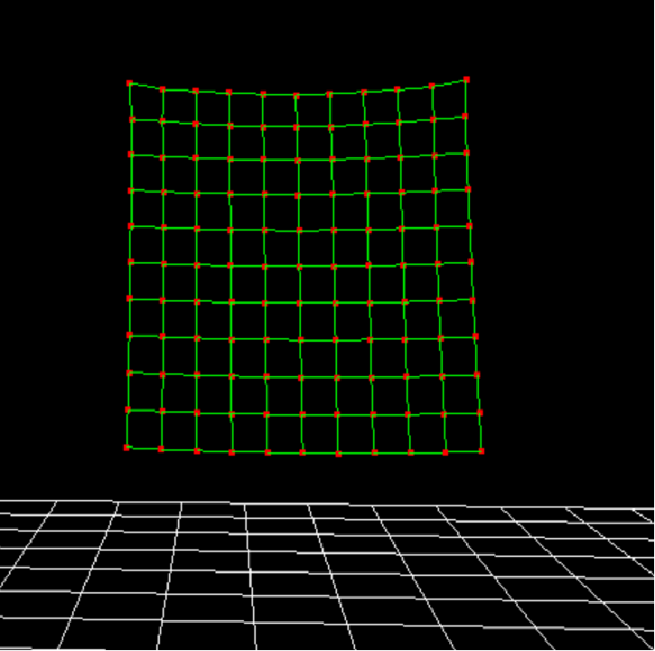

# Cloth Simulation Project Report

This report covers the implementation details of our project, output(s) and a couple of observations and comments we'd like to bring to your notice.

# Implementation Detail

<h3>How to design the cloth?</h3>

A majority of our time went into deciding how we would design our cloth given the variety of methods out there to design a cloth.  The broad categorization looks like:

 - Geometric Techniques
	 - Connected catenary curves followed with relaxation passes
	 - Wrinkle model
 - Physical Techniques
	 - Elasticity Based Methods
	 - Particle Based Methods
	 - Mass – Spring Damper Model

We have chosen the **Mass – Spring Damper Model** for this project.

<h3>How does the Mass-Spring Damper Model work?</h3>

The **Mass – Spring Damper Model** works by assuming the cloth to be a connected set of points forming a grid. Following this, all the points are connected among themselves through a series of springs of $3$ categories:

 1. **Structural Springs:** Handle extension and compression and are connected vertically and horizontally.
 2. **Shear springs:** Handle shear stresses and are connected diagonally.
 3. **Bend springs:** Handle bending stresses and are connected vertically and horizontally to every other particle

<h3>Equations Involved</h3>

$$Force_{gravity}=Mass \times Acceleration_{gravity}$$
$$Acceleration_{gravity} = 9.8 \frac{m}{s^{2}}$$
$$Hooke's \ Law \coloneqq F \propto -\triangle x$$
$$Spring \ Damping \coloneqq F \propto -v$$

<h3>Computing Position Changes</h3>

To simulate the particle physics in our scene, we need to consider a finite $dt$ time interval and compute the changes in $position$, $velocity$, $acceleration$ and $force$ so that the next frame may use these updated values and the system moves ahead.

$Force$ changes can be computed from the above equations.

$Acceleration$ may be computed as $\frac{Force}{mass}$.

For $velocity$, we need to use the kinematic equations:

$$a(t) = \frac{d}{dt} v(t)$$

or for shorthand

$$a = \frac{dv}{dt} \implies dv = a \cdot dt$$

Similarly, $$v = \frac{dx}{dt} \implies dx = v \cdot dt$$

To compute the values of $dv$ and $dx$, we use the **Explicit Euler Integration Method** which tells us that:

$$x(t+dt) = x + dx \implies x(t+dt) = x + v \times dt$$

$$v(t+dt) = v + dv \implies v(t+dt) = v + a \times dt$$

These equations allow us to recompute our values after $dt$ time interval has passed.

## Outputs and Comments

This is a photo of our cloth simulation with just **shear springs**

## The Jakobsen Constraint Relaxation

We noticed that the cloth appears to be far smoother than it should be and the reason for that was the incorrect management of constraints regarding the length of the springs.

Notice that without applying the Jakobsen method, the cloth seems to sag far too much. This is because the cloth was originally having spring rest length of $1$ but after applying the particle dynamics, it shifted to $\gt 1$.

Applying the Jakobsen method allows us to manage the constraints after the particle dynamics has kicked in, so that the mesh stays more or less intact. The resulting cloth is more accurate:

# References

 - Cloth Simulation Book: https://nccastaff.bournemouth.ac.uk/jmacey/OldWeb/MastersProjects/Msc05/cloth_simulation.pdf
 - https://owlree.blog/posts/simulating-a-rope.html
 - Jakobsen Method Paper
 	- http://web.archive.org/web/20080912030612/http://teknikus.dk/tj/gdc2001.htm
	- https://www.cs.cmu.edu/afs/cs/academic/class/15462-s13/www/lec_slides/Jakobsen.pdf

